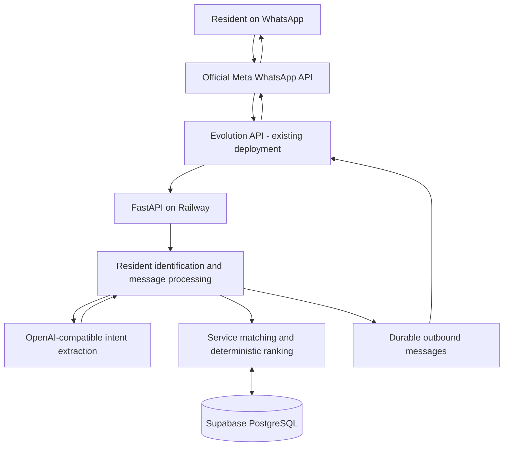

# Home Assistant

Home Assistant is a WhatsApp concierge for residents of **Megapolis, Hinjewadi Phase 3, Pune, Maharashtra, India**. Residents describe a problem, and the backend records their requirement and shares up to three local vendors from the database. There is no frontend.

This repository replaces the earlier in-memory WhatsApp echo application. Python application code, tests, dependencies and documentation have been rebuilt. Git history is retained. The existing Evolution deployment and its official Meta connection remain separate.

## Architecture



The LLM classifies intent and extracts a validated requirement. It has no database connection or tool access. Parameterized application queries select vendors, Python ranks them, and deterministic templates build replies using database fields. The LLM never generates vendor recommendations or contact information.

```mermaid
sequenceDiagram
    participant R as Resident
    participant E as Evolution API
    participant F as FastAPI
    participant D as Supabase PostgreSQL
    participant L as LLM
    R->>E: WhatsApp via official Meta API
    E->>F: POST /webhook/evolution
    F->>F: Authenticate and normalize
    F->>D: Begin transaction; find/create and lock resident
    F->>D: Find/create conversation; insert unique inbound message
    alt Duplicate message
        D-->>F: Existing idempotency key
        F-->>E: 200; no new request or send
    else New message
        F->>D: Read bounded recent context
        F->>L: Message, context, allowed category slugs
        L-->>F: Validated structured intent
        F->>D: Create request and query eligible vendors
        F->>F: Rank and select at most 3
        F->>D: Save recommendations and pending outbound; commit
        F->>D: Claim outbound as SENDING; commit
        F->>E: POST /message/sendText/{instance}
        E-->>R: WhatsApp response
        F->>D: Mark SENT and request VENDORS_SHARED
        F-->>E: 200
    end
```

The durable queue poller can deliver committed pending messages after a restart. No separate queue service is required for this MVP.

## Stack and structure

Python 3.12+, FastAPI, Pydantic v2, SQLAlchemy 2 async ORM, Psycopg 3, PostgreSQL/Supabase, Alembic, httpx, pytest and Ruff. Railway builds the Dockerfile.

```text
app/
  main.py
  api/
    dependencies.py
    routes/{health,webhook,vendors,services,service_requests}.py
  core/{config,logging}.py
  db/
    session.py
    models/__init__.py
    repositories/{common,vendor_repository}.py
  schemas/{api,intent,webhook}.py
  services/
    message_service.py
    resident_service.py
    conversation_service.py
    vendor_service.py
    vendor_ranking_service.py
    ai_service.py
    evolution_service.py
    outbox_service.py
  prompts/service_intent_prompt.py
alembic/
  env.py
  versions/
scripts/{seed,outbox,serve}.py
tests/
.github/workflows/ci.yml
Dockerfile
railway.toml
```

## Database

All ten business tables use UUID primary keys. WhatsApp numbers are unique resident identifiers, not primary keys.

| Table | Purpose |
| --- | --- |
| societies | Expandable geography; initial Megapolis record |
| residents | WhatsApp identity, optional profile and society |
| service_categories | Fifteen supported category definitions |
| vendors | Contact details, verification, location and history |
| vendor_services | Unique vendor/category relationship, availability and optional prices |
| service_requests | Original message, interpretation, urgency, status and service history |
| service_request_vendors | Exact recommendations, rank, score, selected/contacted flags |
| conversations | Resident sessions with at most one open conversation |
| messages | Inbound/outbound history, external IDs, optional JSONB payload, delivery state |
| vendor_feedback | Request/resident/vendor feedback with rating constrained to 1–5 |

Migrations create the requested indexes, foreign keys, unique constraints and checks for ratings, nonnegative job counts, price ranges and ranks 1–3. The source inbound message is unique per service request, and each inbound message can have at most one outbound reply.

Additional message fields support delivery recovery: `instance`, `in_reply_to_id`, `delivery_status`, `delivery_error`, `delivery_attempted_at` and `received_at`. Creation time uses server receipt order; `received_at` preserves Evolution's timestamp when available. `updated_at` is maintained on application/SQLAlchemy updates.

Statuses: `NEW → MATCHING → VENDORS_SHARED → CONTACTED → COMPLETED`; `CANCELLED` is available for administration. Requests with no eligible providers remain `NEW` without recommendations. A recommendation stays `MATCHING` until Evolution accepts its outbound response.

The reference migration inserts Megapolis and all fifteen categories. PostgreSQL row-level security is enabled without public policies on every business table. Supabase anon/authenticated API roles therefore receive no access to this data. The trusted backend connects as the table owner, or as a dedicated server role with carefully managed privileges and RLS access. Do not expose database credentials to clients.

## Local setup

1. Install Python 3.12+ and obtain a development PostgreSQL database or a separate Supabase development project.
2. Create a virtual environment and install dependencies:

```bash
python -m venv .venv
# Linux/macOS:
source .venv/bin/activate
# Windows PowerShell:
.venv\Scripts\Activate.ps1

pip install -r requirements-dev.txt
```

3. Copy `.env.example` to `.env` and fill the database, Evolution and LLM values. Settings load `.env` automatically; process environment variables take precedence. Keep `.env` untracked.
4. Apply migrations and optionally seed fictional development data:

```bash
alembic upgrade head
python -m scripts.seed
```

5. Start the server:

```bash
uvicorn app.main:app --host 0.0.0.0 --port 8000 --no-access-log
```

On Windows, use `python -m scripts.serve` to select the event loop required by Psycopg. This launcher also respects `PORT`.

Health: `http://localhost:8000/health`. Swagger: `http://localhost:8000/docs`. OpenAPI: `/openapi.json`. Swagger remains enabled for development/testing. The webhook stays authenticated even in development; missing configuration returns 503.

For an entirely offline database smoke test, development dependencies include SQLite support:

```powershell
$env:DATABASE_URL = "sqlite+aiosqlite:///local.db"
alembic upgrade head
python -m scripts.seed
```

SQLite is only for tests/development. Production requires PostgreSQL. Tests mock both external services; running the application with actual Evolution credentials can send actual WhatsApp messages.

## Supabase setup

1. Create a dedicated Supabase project/database for this application. Do not aim the initial migrations at an unrelated schema containing tables with the same names.
2. In the project's Connect panel, obtain a PostgreSQL direct or **session pooler** connection string. Session pooling on port 5432 is useful for Railway environments that require IPv4. This persistent backend uses a small local connection pool. See [Supabase connection guidance](https://supabase.com/docs/guides/database/connecting-to-postgres).
3. Use the SQLAlchemy driver prefix `postgresql+psycopg://`. Plain `postgresql://` and `postgres://` URLs are normalized. URL-encode special characters in the password.
4. Enable TLS using `?sslmode=require` at minimum. Where the CA certificate is deployed, prefer `sslmode=verify-full&sslrootcert=/path/to/ca.crt` for certificate and hostname validation. See [Supabase SSL guidance](https://supabase.com/docs/guides/platform/ssl-enforcement).
5. Set `DATABASE_URL`. Optionally set `MIGRATION_DATABASE_URL` to a direct/session URL for migrations. Prepared statements are disabled in the Psycopg connection configuration.
6. Run `alembic upgrade head`. This creates the schema, reference data and RLS configuration. Confirm `alembic current` reports `0002`.
7. Use `python -m scripts.seed --reference-only` if you need to restore missing reference records. Add real, consented vendor records through trusted database administration before launching publicly.

`SUPABASE_URL` and `SUPABASE_KEY` are reserved optional settings. They are not used for queries: SQLAlchemy connects directly to PostgreSQL using `DATABASE_URL`.

## Environment variables

| Variable | Purpose / default |
| --- | --- |
| DATABASE_URL | PostgreSQL connection URL; required for a working deployment |
| MIGRATION_DATABASE_URL | Optional migration connection, otherwise DATABASE_URL |
| SUPABASE_URL, SUPABASE_KEY | Optional reserved Supabase metadata |
| EVOLUTION_API_BASE_URL | Existing Evolution server base URL, without /manager |
| EVOLUTION_API_INSTANCE | Exact instance name; defaults to home-assistance |
| EVOLUTION_API_KEY | Evolution API key, not a Meta access token |
| WEBHOOK_SECRET | Shared webhook secret; at least 32 characters in production |
| OPENAI_API_KEY | API key for the configured OpenAI-compatible provider |
| OPENAI_MODEL | Model supporting chat completions and JSON-object output |
| OPENAI_BASE_URL | Defaults to https://api.openai.com/v1 |
| APP_ENV | development, test or production; default development |
| ADMIN_API_KEY | X-Admin-Key for read APIs; required in production |
| DEFAULT_SOCIETY_NAME | Megapolis; routing currently assumes initial Pune locality |
| MAX_CONTEXT_MESSAGES | Maximum recent messages to LLM; default 8, maximum 30 |
| MAX_CONTEXT_CHARACTERS | Maximum history characters; default 6000, maximum 20000 |
| LLM_TIMEOUT_SECONDS | Default 20 |
| EVOLUTION_TIMEOUT_SECONDS | Default 15 |
| EVOLUTION_MAX_ATTEMPTS | Safe transient send attempts; default 3 |
| OUTBOX_ENABLED | Run the durable queue poller; default true |
| OUTBOX_POLL_SECONDS | Default 3 |
| STORE_RAW_PAYLOADS | Default false; opt-in raw entry storage contains personal data |
| PORT | Set by Railway; read by the Docker startup command |

Production requires nonempty Evolution, LLM and admin keys, a model, a long webhook secret, PostgreSQL and HTTPS provider URLs. Development permits missing LLM configuration so health/API testing can run; incoming messages receive a temporary-unavailable response until configured.

Generate secrets locally with `python -c "import secrets; print(secrets.token_urlsafe(32))"`. Never paste generated values into source files or commits.

### Migration from the old Railway echo service

| Existing variable / setting | New setting |
| --- | --- |
| EVOLUTION_API_URL | Rename to EVOLUTION_API_BASE_URL |
| EVOLUTION_INSTANCE | Rename to EVOLUTION_API_INSTANCE |
| EVOLUTION_API_KEY | Keep |
| WEBHOOK_SECRET | Keep, provided it is at least 32 characters |
| uvicorn main:app | Replace any Railway override with uvicorn app.main:app |
| No database/LLM | Add DATABASE_URL, OPENAI_API_KEY, OPENAI_MODEL |
| No admin auth | Add ADMIN_API_KEY and set APP_ENV=production |

The two legacy Evolution names remain accepted aliases. If both old and new names exist, the new name takes precedence. The default instance stays `home-assistance` to preserve the old deployment's spelling.

## Fictional seed data

`python -m scripts.seed` is repeatable and performs conflict-safe inserts without deleting data. It creates:

- 1 society and 15 categories.
- 5 fictional residents and 20 fictional vendors.
- 40 vendor/category relationships.
- 6 historical requests, including unmet maid demand.
- 5 conversations, 12 historical messages, 5 recommendations and 5 feedback records.

All resident/vendor names are labeled fictional or TEST. Phone fields contain non-dialable strings such as `TEST-RESIDENT-001` and `TEST-VENDOR-001`. There are no randomly generated Indian numbers. The Evolution client rejects synthetic recipients before making an HTTP call, and the seed never invokes either provider.

The dataset includes verified/unverified vendors, varied ratings and job history, multiple-category vendors, an inactive plumber and an unavailable plumber relationship. There are **no maid vendor relationships**, so “Need maid” exercises unmet demand.

Demo seeding is disabled with `APP_ENV=production`. Use a development database for demos and `--reference-only` in production. Seeded aggregate vendor ratings/history are fictional ranking fixtures; subsequent real feedback aggregates recorded feedback.

## Matching, memory and feedback

Eligible vendors must be active, have an available relationship to an active requested category, and cover the resident's society or locality in the same city. Other cities are excluded. Ranking follows this strict priority:

1. Same society, then same locality.
2. Verified status.
3. Rating, with missing rating treated as unrated.
4. Successful jobs, capped at 999 as a tie-breaker.
5. UUID ascending for stable ties.

The maximum is always three. Scores and vendor IDs are stored in `service_request_vendors`. Unverified providers may be included, with verification status clearly shown. Contact information comes from `vendors.primary_phone`. No prices or availability guarantees are invented.

A request with no matching category or vendor is saved without recommendations and receives a natural unavailable-service reply. Query `/api/service-requests?unmet_demand=true` to inspect this demand.

Only recent inbound and successfully sent outbound messages are loaded, bounded by both message count and character budget. The current input is supplied separately and is capped at 4096 characters. Phone-like strings are redacted from LLM context. Other user-provided personal details may still be included; choose an appropriate LLM provider and retention policy. The context-loading service can later be replaced with conversation summaries.

Residents can say “I contacted vendor 1” or “Vendor 1 gets 5 stars.” The LLM extracts intent and rank; the application validates that the rank belongs to this resident's latest request. Ambiguous feedback prompts for clarification. Feedback is unique per request/resident/vendor. Explicit ratings mark the request completed; ratings of at least 3 count as successful jobs.

## Evolution API configuration

Use the already deployed Evolution service connected to official Meta WhatsApp. FastAPI does not handle Meta tokens, Meta webhook verification, or the Meta Cloud API directly.

Configure the Evolution instance's outgoing webhook:

- URL: `https://YOUR-FASTAPI-DOMAIN/webhook/evolution`
- Event: `MESSAGES_UPSERT`
- Webhook by Events: OFF
- Webhook Base64: OFF
- Header: `x-webhook-secret: YOUR_WEBHOOK_SECRET`

If the installed Evolution version cannot set custom headers, the existing `?token=YOUR_WEBHOOK_SECRET` fallback is supported. Prefer headers: query-token URLs can appear in proxy logs. Docker disables application access logs. Keep the existing Meta-to-Evolution callback unchanged.

Supported contract: an Evolution v2-style normalized envelope, with a single `data` object or list, `key.id`, `key.remoteJid`, strict `key.fromMe=false`, and either `message.conversation` or `message.extendedTextMessage.text`. The optional Unix-seconds `messageTimestamp` is retained when valid.

```json
{
  "event": "messages.upsert",
  "instance": "home-assistance",
  "data": {
    "key": {
      "id": "TEST-EVENT-001",
      "remoteJid": "12025550101@s.whatsapp.net",
      "fromMe": false
    },
    "message": {
      "conversation": "Hi, I need a plumber urgently. My kitchen sink is leaking."
    },
    "messageTimestamp": 1789196400
  }
}
```

This example uses a reserved fictional NANP number, not an Indian resident's number. Use mocked clients, as the tests do; do not submit it to a production webhook expecting a real delivery.

Own messages, groups, broadcasts, media, unresolved LID senders, wrong instances and missing/invalid IDs are ignored. Messages without external IDs are deliberately not processed: accepting them would defeat reliable deduplication. Invalid JSON returns 400; malformed entries are ignored; bodies above 256 KiB or batches above 50 supported messages return 413.

Outbound contract: `POST /message/sendText/{instance}`, `apikey` header, JSON `{"number": "recipient digits", "text": "reply"}`. The client uses configurable timeouts and bounded retries for connection failures before send and explicit 429 responses. Validate this contract against your installed Evolution version during the deployment smoke test.

## Idempotency and delivery guarantees

The database unique key is `(instance, direction, external_message_id)`. Resident row locks serialize messages from the same resident; uniqueness also protects against concurrent deliveries across workers. Inbound message, request, recommendations and pending reply commit atomically. Duplicate webhooks acknowledge without another LLM call, request or reply.

The messages table is the durable outbox. A conditional database update claims a pending message as `SENDING` before the network call, preventing two workers from sending it. A 2xx response records `SENT`; this means accepted by Evolution, not confirmed read/delivered by WhatsApp.

A network send cannot participate in the PostgreSQL transaction. **Exactly-once external delivery cannot be guaranteed without a provider-supported idempotency contract.** To prioritize avoiding duplicate replies:

- Pending messages are recovered automatically after restart.
- Definitely rejected or exhausted safe attempts become `FAILED`.
- Read/write timeouts, HTTP 408/5xx and uncertain outcomes become `UNKNOWN`, without automatic resend.
- Crashes after claiming a send leave `SENDING`; after ten minutes the poller marks it `UNKNOWN`.
- A crash after Evolution accepts a send but before the database confirmation may leave an unknown delivery. Reconcile this with Evolution before taking action.

Inspect pending/problem deliveries without exposing phones or text:

```bash
python -m scripts.outbox
python -m scripts.outbox --retry-failed OUTBOUND_MESSAGE_UUID
```

The retry command only queues `FAILED` rows, never `UNKNOWN` or `SENDING`. Fix configuration/connectivity first. Unknown deliveries require operator reconciliation in Evolution; blindly resending risks a duplicate. Monitor structured `outbound_delivery` events and database queue state.

## HTTP endpoints and security

| Endpoint | Purpose |
| --- | --- |
| GET /health | Database connectivity; 503 when unavailable |
| POST /webhook/evolution | Authenticated Evolution webhook |
| GET /api/services | Active categories |
| GET /api/vendors | Active vendors; optional service slug and society_id filters |
| GET /api/vendors/{id} | Vendor details |
| GET /api/service-requests | History; optional status and unmet_demand filters |
| GET /api/residents/{id}/requests | Resident's service history |

Listing vendors and requests supports `limit` (1–100) and `offset`. UUID parameters are validated. All `/api/*` routes share an authentication dependency; supply `X-Admin-Key` when configured. Production requires the key. Development permits unauthenticated inspection only when no key is configured. Replace this dependency with user/role authentication when needed.

Logs exclude message text, phone numbers, payloads, provider response bodies and keys. SQLAlchemy hides bound parameters. Secrets use masked Pydantic types. Raw webhook storage is disabled by default. Configure retention, restricted DB access and backups before accepting real resident data.

## Tests and checks

```bash
pytest -q
ruff check app scripts tests alembic
ruff format --check app scripts tests alembic
python -m compileall -q app scripts alembic
alembic check
```

The tests mock both the LLM and Evolution API. They never send WhatsApp messages. Coverage includes the exact urgent-plumber and unavailable-maid scenarios, malformed payloads, duplicate/concurrent webhooks, resident/conversation/message creation, bounded context, structured AI validation, database errors, deterministic ranking, inactive/unavailable exclusion, recommendation limit, feedback, auth, seed repeatability, provider failures and queue recovery.

The default suite uses isolated SQLite files. Set `TEST_POSTGRES_URL` to a disposable PostgreSQL database to run the same suite against PostgreSQL. Each test creates and removes a uniquely named test schema; the account needs schema creation rights. Do not point tests at a production database. GitHub Actions provisions PostgreSQL 16, checks migrations and schema drift, repeats the seed and runs the suite.

For a migration-only SQL review:

```bash
alembic upgrade head --sql
```

A downgrade to `base` deletes all application tables. Use this only on disposable databases. A downgrade from 0002 to 0001 disables the RLS additions but preserves reference rows because they may be in use.

## Railway deployment

1. Connect this GitHub repository to the FastAPI Railway service. Keep Evolution as its existing separate service.
2. Railway builds `Dockerfile`. `railway.toml` runs `alembic upgrade head` before deployment, checks `/health`, and configures restart-on-failure.
3. Set all production variables listed above; set `APP_ENV=production`. Do not store real secrets in the repository.
4. Clear the old `uvicorn main:app` Railway start-command override if present. The Docker command is equivalent to:

```bash
uvicorn app.main:app --host 0.0.0.0 --port $PORT --no-access-log
```

5. Generate/retain the public domain, verify `/health` reports database connected, and configure Evolution's webhook URL.
6. Populate real vendor data through trusted DB administration. Keep dummy data in a separate development project.
7. Send the urgent plumber message from a controlled test account; verify persisted request, at most three recommendations, one accepted outbound and no extra send on webhook redelivery. Then test “Need maid” against a database with no eligible maid providers.
8. Inspect Railway deployment logs and `python -m scripts.outbox` after the smoke test.

A single replica is simplest for this MVP. Database uniqueness and delivery claims support concurrent workers/replicas; each process has a small database pool. Scale with Supabase connection limits in mind. Deploy migrations once per release, not independently in each Uvicorn worker.

## Troubleshooting and MVP limits

| Symptom | Check |
| --- | --- |
| /health returns 503 | Database URL, URL-encoded password, TLS settings, DNS/network and Supabase availability |
| Startup fails in production | Required keys/model, HTTPS URLs and webhook secret length |
| Webhook returns 401 | Header/query secret must match WEBHOOK_SECRET |
| Webhook returns 503 | Database/migrations/default society; logs expose error class without secrets |
| Webhook ignored | Event, instance spelling, fromMe flag, text format, sender JID and message ID |
| Response says it cannot understand | LLM key/model/base URL, JSON support, timeout or invalid structured output |
| No vendors returned | Category active, vendor active, relationship available, society/locality and city |
| Request remains MATCHING | Inspect outbound queue; recommendations are not marked shared until send acceptance |
| FAILED outbound | Check Evolution URL/key/instance and rejection; retry only after fixing the cause |
| UNKNOWN outbound | Reconcile Evolution history; do not blindly resend |
| Windows Psycopg event-loop error | Run python -m scripts.serve |
| Schema drift | Run migrations; use alembic check; never use create_all for production upgrades |

Text only, one active conversation per resident, one latest request for feedback context, direct contact sharing and no appointment booking, dispatch, payment, masking or relay calls. Availability is a database flag rather than a live provider guarantee. WhatsApp template/session rules are enforced by the existing Evolution/Meta setup. New societies can be added to the schema and assigned to residents; onboarding/routing for multiple deployments is future work.

The repository can be validated without live credentials. Supabase provisioning, production secrets, real vendor onboarding and the real Evolution/WhatsApp smoke test are deployment actions that must be performed in the target environment.
